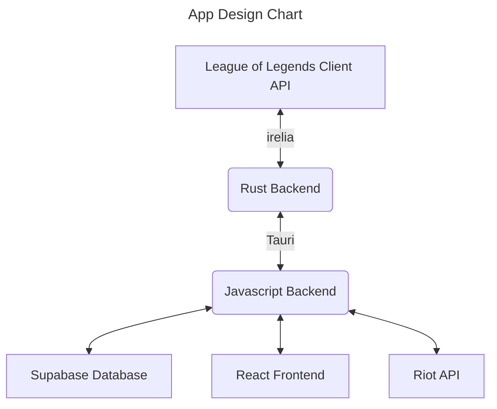
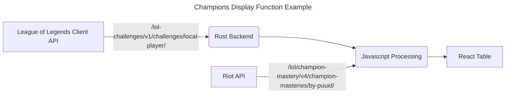
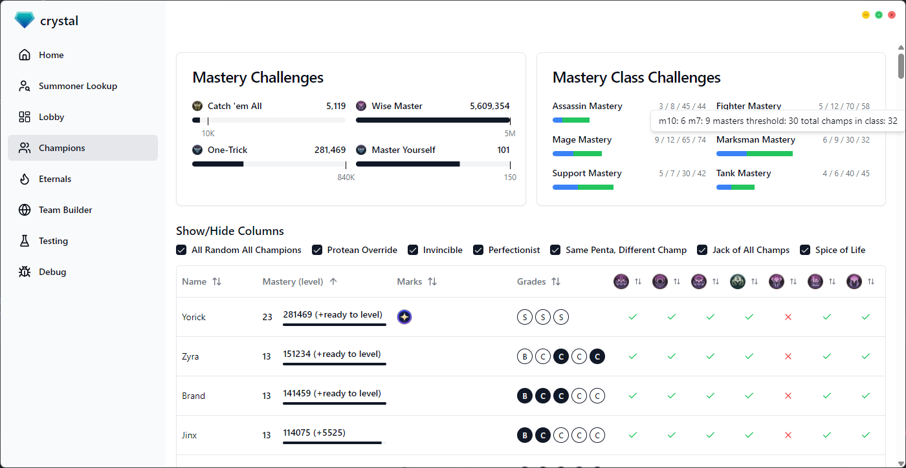
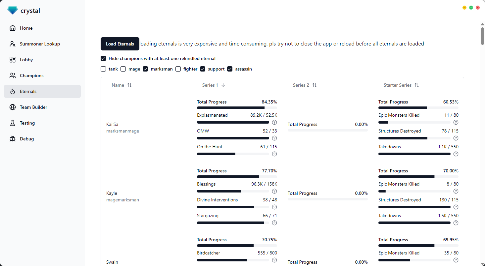
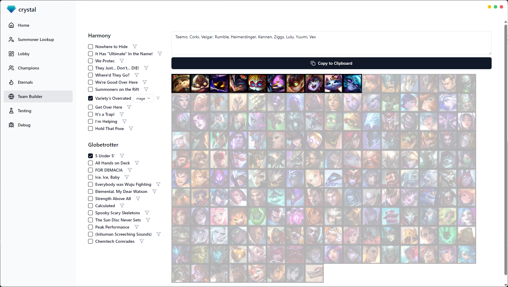

# Crystal

desktop client to help you keep track of your league challenges! screenshots incoming

uses tauri, react, tailwind, shadcn, typescript, and v0

special thanks to sylv for help with [irelia](https://github.com/AlsoSylv/irelia)

## todo

- [ ] set search filters
- [ ] take screenshots
- [ ] add globes, seasonal, and token setter to home
- [ ] add tooltips to auto globe multisearch
- [ ] add aram champ select tracker
- [x] fix column visibility in champion table
- [ ] add seasonal mark of mastery tracker
- [ ] add counts to team builder
- [ ] eternals up to 15 (math with 10x the 5th milestone count)
- [x] potential issue if people have eternals finished on legacy eternals
- [x] eternals per champion role
- [ ] add eternals summary to top of eternals page
- [ ] improve comparison
- [ ] skin challenge tracker
